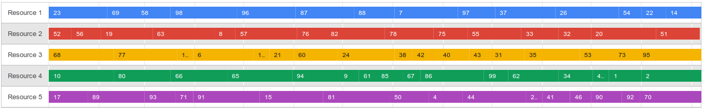
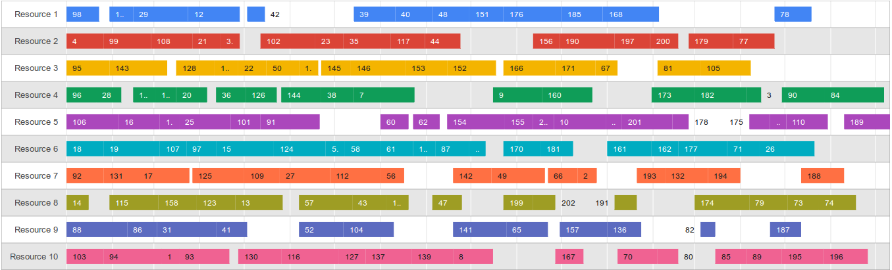

# MS-RCPSP
This repository contains a suboptimal solution (and its visualizations) of MS-RCPSP problem using simple genetic algorithm as a part of bachelor thesis.

## About MS-RCPSP problem
MS-RCPSP stands for Multi-Skill Resource Constrained Project Scheduling Problem, it is and NP-complete scheduling problem. Given a set of workers (a.k.a. *resources*), each possessing certain skills at certain levels, and a set of tasks, each with its own duration, (one) skill requirement and possible dependencies on other tasks, one has to find the sequence of tasks along with workers assignments that minimizes the total time of execution of all tasks. The conditions are as follows:
 * every task can only be completed by one person and cannot be pre-empted
 * no task can be started until all its dependencies (tasks) are finished
 * workers can only execute one task at a time
 * worker must possess the required skill at (not smaller than) required level in order to complete the task

## Solution
The solution implements a simple GA (genetic algorithm) using this interpretation:
 * specimen are schedules
 * genes are task assignments (assigned workers)

GA uses tournament selection and simple mutation and crossover operators. LAX crossover operator from [this paper](http://imopse.ii.pwr.edu.pl/files/Pages_57_62_Mendel2013_PRESS.pdf) has also been implemented as an experimental option.

When it comes to schedule building strategy, the solution in `simple` branch uses a so-called *schedule-builder* procedure, which generates a non-conflicting starting times for all tasks using worker assignments encoded in the genotype. Meanwhile the solution in `master` branch also encodes *task priority* in gene (along with worker assignment), so that when the worker is able to execute several tasks at some point, he always executes the task with the highest priority first. The simple solution is generally faster, but also greedier and performs worse on tasks with many dependencies. However, in simpler cases it proves to be a fast and viable solution.

## Build
### Bazel
You can use [Bazel](https://github.com/bazelbuild/bazel) build system to easily build the solution. This way you don't have to install GFlags manually on your system. To build the binary use:
```
bazel build -c opt :ga_bin
```
It will create `bazel-bin` directory, where you can find `ga_bin` binary along with `libga_lib.a` static library.

### CMake
You can use `CMakeLists.txt` to build the binary just as you would expect:
```
cmake CMakeLists.txt && make
```
You must have `libgflags` installed to use this option. For example, on Ubuntu you can install it as follows:
```
sudo apt-get install libgflags-dev
```

## Quick start
This is a quick guide for those who want to use the library to experiment with their own solutions.

Read scheduling project from file:
```c++
SchedulingProblem::ProjectReader::read("project.def");
```
Create your own solution:
```c++
// MyAlgo.h

template <class T>
class MyAlgo : EvolutionaryAlgorithm::Algorithm<T> {
 public:
  std::shared_ptr<T> optimize() override;
};

#include "MyAlgo.tpp"

// MyAlgo.tpp

template <class T>
std::shared_ptr<T> MyAlgo<T>::optimize() {
  // implement your solution here
}
```
Or use existing one:
```c++
// Create operators.
// SimpleSchedule is the default implementation of Schedule.
std::shared_ptr<Selector<SimpleSchedule>> sel =
    std::make_shared<TournamentSelector<SimpleSchedule>>(FLAGS_tournament_size);
std::shared_ptr<Crossover<SimpleSchedule>> cross =
    std::make_shared<OnePointCrossover<SimpleSchedule>>(FLAGS_crossover);
std::shared_ptr<Mutator<SimpleSchedule>> mut =
    std::make_shared<SimpleMutator<SimpleSchedule>>(FLAGS_mutation);
// Initialize GA.
GeneticAlgorithm<SimpleSchedule> algo(pop_size, /* population size */
                                      sel,      /* selection operator */
                                      cross,    /* crossover operator */
                                      mut,      /* mutation operator */
                                      200,      /* number of generations */
                                      false     /* don't remove clones */);
// Run GA.
std::shared_ptr<SimpleSchedule> schedule = algo.optimize();
// Output result.
std::cout << "Result fitness value: " << schedule->fitness() << std::endl;
```
Validate your solution:
```c++
std::pair<bool, std::string> valid =
    SchedulingProblem::Validator::validate(schedule);
if (valid.first) {
  std::cout << "Solution is valid." << std::endl;
} else {
  std::cout << "Error message: " << valid.second << std::endl;
}
```

## Extension
The API allows you to implement your own parts of GA:
 * specimen (schedule) representation, along with crossover and mutation operators for it
 * selection operators
 * standalone crossover and mutation operators for existing representations

In order to do so, you have to subclass one of dedicated base classes and implement all necessary functions. For details, please refer to [API documentation](https://zip753.github.io/ms-rcpsp/).

## Test data
The solutions have been tested and validated on benchmarking corpus of iMOPSE project. The dataset and validation tool can be found [here](http://imopse.ii.pwr.edu.pl/download.html).

## Visualizations
In order to comprehend the problem the solutions better, I have implemented the visualization tool for showing the business of each worker throughout the project execution. The tool takes a solution file and generates an HTML page with Google Timeline chart based on the solution data. An example of such chart is shown below:



As you can see, each worker is busy throughout the whole project, therefore it is easy to state that the following solution is optimal for the given input. On contrary, the next image isn't that trivial and contains gaps due to the numerous task dependencies:


